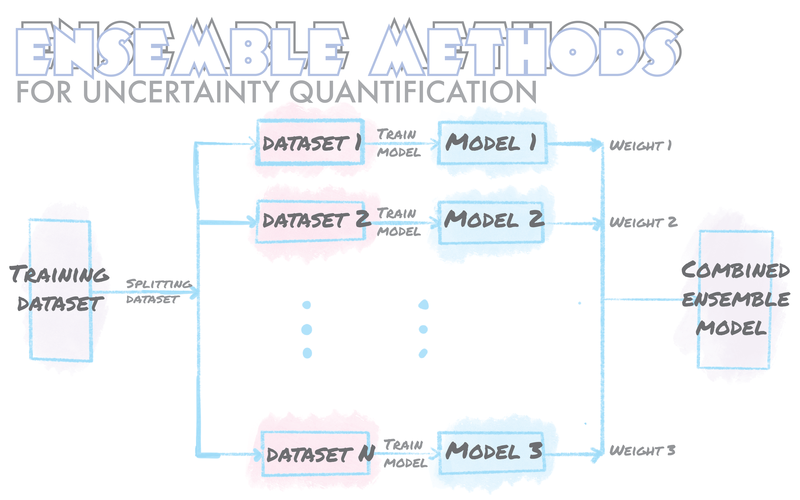
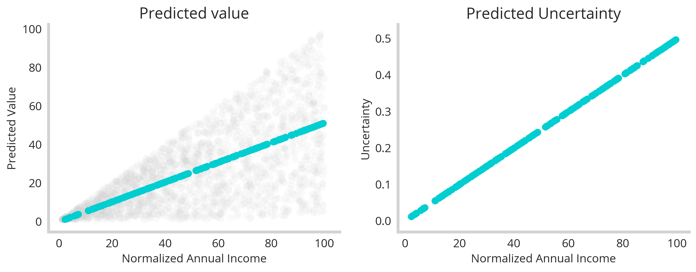
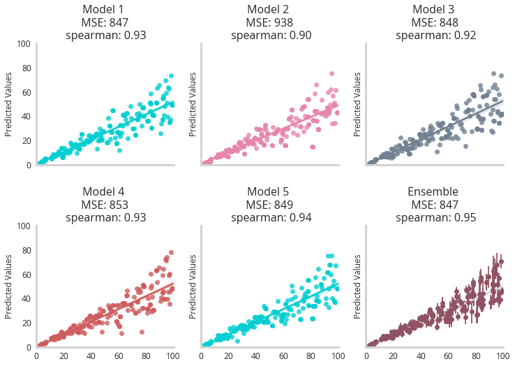
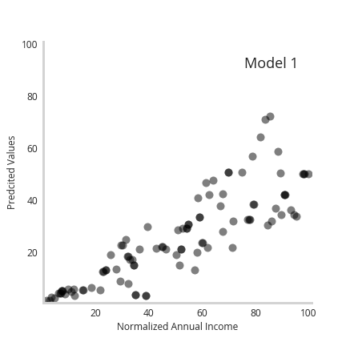
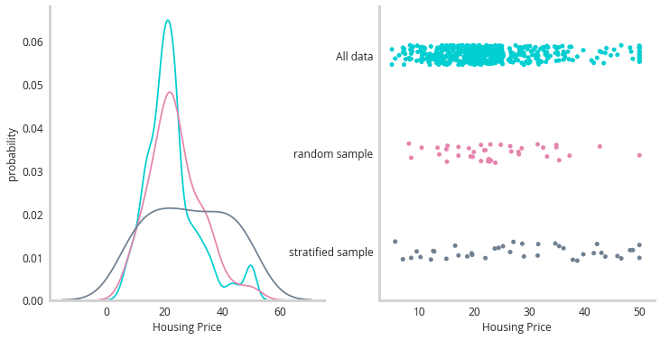
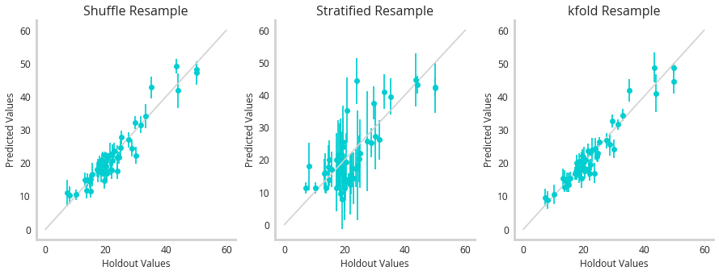
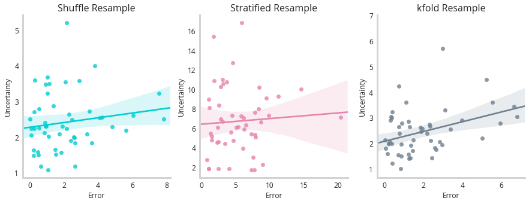

<html>

<style>
      h1,h2,h3,head,title {
        font-family: 'open-sans';
        font-weight: 1000;
        outline-color: white;
        color: black;
        background: #ffcccc url(res/blog_17/leaves2.jpg) repeat 0 0;

        text-shadow:
        -.5px -.5px 0 #000,
        .5px -.5px 0 #000,
        -.5px .5px 0 #000,
        .5px .5px 0 #000;
}
</style>
</html>





### Uncertainly Quantification and How much we pay for lunch.


Uncertainly quantification can be something of an abstract concept, but let's try to anchor it to a simple question.
```python
Can you guess how much someone spent on lunch based on how much they make?
```
While the initial intuition might be "yeah it simply correlates with how much they earn" - consider this : rich people still eat the occasional fast food. Mark ZUCC might have a banana and some bread for lunch (cheap) or he might eat some endangered animal (expensive). However, poor people don't have those kind of options.  They're basically restricted to budgeting on every meal. In other words, the uncertainty of how much someone spends on a meal increases as a function of their income. This is an example of [heteroscedastic](https://en.wikipedia.org/wiki/Heteroscedasticity) uncertainty : variability that is not uniform across the feature space. If we were tasked with building a lunch price forecasting model, it may be necessary to quantify this kind of uncertainty.

Consider the following graphs:


The graph to the left shows some raw imagined data relating how wealthy someone is to how much they spent on their last meal (grey dots). While there is a clear trend line (turquoise), this fails to capture the uniqueness of the data : that the uncertainly from that trend increases as a function of wealth as well. The graph to the right shows the perfect analytical mapping of this data. Using the closed form solution to the standard deviation of a uniform distribution (how the data was generated) we see the goal of our uncertainty model - to perfectly capture the uncertainty.

The important thing is that *uncertainty* is part of this system. Its not something we want to filter out, its' something we want to quantify. The only question is how do we do it? For our first attempt, we will use a collection of linear models, collated into an ensemble.

### Using ensemble learning to quantify uncertainty : linear models

Ensemble models are simply meta machine learning models built from several smaller models. These individual member models can all have the same or different architectures and be trained on smaller slices of the total training dataset. Each member model then offers up a prediction as to what it thinks the solution will be. All the member predictions are then synthesized to form a final prediction based on taking some average or biased sum of all the members. The uncertainty measure is derived from how much these member models disagree with each other.

The simplest implementation of this that I'll start with is an ensemble model built from a series of linear regressions, each trained on a different subset of the training data.


A very simple implementation of this can be seen below. Here we train 5 (n_splits=5) linear regression models with shuffle split fractions of the data. In the predict method we then use each of these models to find a solution and then take the mean response. The *uncertainty* is simply the standard deviation of predictions around this mean.


```python
class LinearUncertaintyPredictor():
    def __init__(self,X_data,y_data):
        self.X_train =X_data
        self.y_train = y_data
        
    def train_models(self,n_splits=5,kernal='linear'):
        '''Function for training models 
        Inputs:
        X_dataset: Inputs of the training data (MxN)
        y_dataset: Outputs of the trainig data (1xN)
        params: the parameters of the LGBM model
        n_split: the number of splits to be used to creat int(n_splits) seperate models

        Returns:
        models: int(n_splits) number of independent models trained on the folds of the data
        '''

        ss = ShuffleSplit(test_size=1/n_splits,n_splits=n_splits,random_state=88)

        models=[]
        coeffs=[]
        for train_index, test_index in ss.split(self.X_train):
            X_train, X_val =self.X_train[train_index,:], self.X_train[test_index,:], 
            y_train, y_val =self.y_train[train_index], self.y_train[test_index]
            reg = LinearRegression(fit_intercept=False).fit(X_train, y_train)
            
            models.append(reg)
            coeffs.append(reg.coef_[0][0])
        self.models=models
        self.coefficients=coeffs
        
    def predict(self,X):
        predictions=[]
        for model in self.models:
            predictions.append(model.predict(X))
        
        # Values chosen by mean committe
        ensemble_predictions =np.mean(np.stack(predictions, axis=0) ,axis=0)
        ensemble_uncertainty=np.std(np.stack(predictions, axis=0) ,axis=0)
        self.predictions={'prediction':ensemble_predictions,'uncertainty':ensemble_uncertainty}
        self.raw_predictions={'X':np.squeeze(np.stack(predictions, axis=0))}
        
        return self.predictions
```

To evaluate this model, we simply split off a true holdout set and then train our ensemble on the remaining fraction.

```python
X_dataset, X_holdout, y_dataset, y_holdout = train_test_split(x_values, y_values, test_size=0.1,random_state=88)
Predictor=Linear_Uncertainty_Predictor(X_dataset,y_dataset)
Predictor.train_models(n_splits=5)
```

Now, let's see how it performed. 




First, the "prediction" of this model seems to correlate perfectly with our expected trend (left). But that's no surprise. What's more important is that our uncertainty correlates monotonically with income (right). This shows that our ensemble effectively did map out the underlying uncertainty of the data as a function of the feature space. This shows that even a series of simple member models can reveal interesting things about the uncertainty of a dataset. 


### More sophisiticated models : LightGBM  

In order to show how more flexible base models impact the results, we simply swap out the linear regression for LightGBM (The code and notebooks can be found [here](https://github.com/NicholasARossi/UQ_methods)). Tree based algorithms like light GBM offer a lot more flexibility for complex, non-linear relationships. Below we see how a 5 member LGBM ensemble model looks after being trained.



We see that each model becomes more erratic in its predictions as the income of the person increases, with the ensemble model showing higher error bars indicating higher uncertainty. 

Furthermore, the animation below shows how the individual preditions move a as a function of the member model, with predictions for higher earners moving them most.



Together, we see incorporating more complex or flexible models enables accurate recapitulation of underlying data uncertainty. 


### Real Data, Multiple Features and Stratification


So far we've only looked at a synthetic data set with one input feature and one output, but these sort of uncertainty quantification methods generalize well to more complex datasets. To illustrate this, let's take a look at the boston housing dataset, one of the canonical datasets for regression problems. 

```python
from sklearn.datasets import load_boston
X, y = load_boston(return_X_y=True)
```

Not only does this dataset not have artificial levels of uncertainty, it also has multiple input features that can be used to predict the price of a house in Boston (location, crime statistics, schooling etc). One additional point of interest is the "skew" of the dataset, that is to say that there aren't equal numbers of every price of home. Broadly, this is described as the *imbalanced class* problem, and it works for continuous data as well. This can pose a real problem for this sort of uncertainty quantification in certain circumstances so it's an important thing to keep in mind. The figure below illustrates the skew of the data.


The turquoise line illustrates the shape of all training data, with most houses priced towards the lower end of the arbitrary scale, with a fat tail of higher priced homes. We need to sample from this distribution for the data subsets for our candidate models - but which technique to use? Broadly we could use **k-fold** or **shuffle** splitting to pull random samples from the underlying distribution (pink line). Or we could attempt to stratify sample this data (grey line). Stratify sampling attempts to sample evenly throughout the space. It involves first binning the data and then assuring that you get an even number of samples from each bin. A minimal implementation of a stratified split helper function can be seen below.

```python
def continuous_stratification(y,n_bins,test_size=0.1):
    '''Function that returns the stratified indexes of a continously valued y'''
    bins=np.linspace(min(y), max(y),n_bins)
    digitized_y=np.digitize(y,bins)
    index_list=np.arange(len(y))
    stratified_indexes=[]

    n_samples=int(len(y)*test_size)
    bucket_list=list(set(digitized_y))
    n_samples_per_bucket=int(n_samples/len(bucket_list))

    for bucket in list(set(digitized_y)):
        sub_index_list=index_list[digitized_y==bucket]
        sample_indexes=np.random.choice(sub_index_list,size=n_samples_per_bucket,replace=False)
        stratified_indexes+=list(sample_indexes)
    # returns test and train indexes
    return np.array(stratified_indexes),np.setdiff1d(index_list,stratified_indexes)

```

So the question is now : how do these sampling techniques add up? To test them, we trained a 5 member LGBM ensemble using shuffle splitting, stratified splitting or kfold to resample the data subsets to train the models with. Then we measured their performance against a holdout set.



So it actually seems like the stratified sample has the worst correlation between predicted and true values (should be 1:1). But remember that's only half of the functionality of a model like this. We should be seeing correlations between uncertainty and error - suggesting this model is self aware of the mistakes it's making.



This figure shows little correlation between any of these models uncertainty and error, however k-fold performs the best. This highlights that while these methods have clear merit on synthetic data, they struggle more with real world examples where the uncertainty is more subtle. 


### Conclusion

This served as an introduction to the power of ensemble methods for uncertainty quantification. While they have their limitations, they serve a low complexity solution to this burgeoning field of machine learning. Future posts will focus on more complex implimentations of PyMC3 and Tensorflow probability to solve similar problems. 


### Notes
* Notebook necessary to generate all the graphs and more [here](https://github.com/NicholasARossi/UQ_methods/blob/master/notebooks/Ensemble_methods.ipynb)
* The rest of the model and helper scripts [here](https://github.com/NicholasARossi/UQ_methods)


