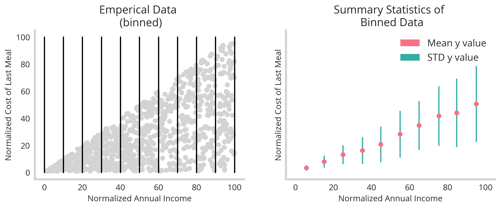

<html>
<link rel="stylesheet" href="/res/blog_15/manni.css">
<style>
@font-face {
  font-family: 'futura';
  src: url('/res/blog_10/futura.ttf') format('truetype');
  font-weight: normal;
  font-style: normal;
}
  h1,h2,h3,head,title {
    font-family: 'futura',serif;
    color: Black;
    background-color: lightgrey;
  }
</style>
</html>


In our [previous episode](https://www.rossidata.com/UncertaintyQuantificationandEnsembleLearning) we investigated how ensemble methods could be leveraged to quantify the uncertainty of an underlying data-set. While this approach was super easy to implement it fell short of recapitulating the exact discordance between observed and predicted values for the most part. Here we explore a more conceptually straight forward approach to training models simultaneously to predict both a value an the underlying uncertainty of that prediction. Per usual, we start with the simplest implementation : a linear model.

### Linear Regression trained to predict value and uncertainty simultaneously

Linear models in sk-learn or any comparable ecosystem are well equipped to handel predictions of multiple values simultaneously. We simply need to feed in the relevant data for both mean value and associated uncertainty. 

To evaluate this, we return to our mean income versus meal expenditure synthetic dataset from [before](https://www.rossidata.com/UncertaintyQuantificationandEnsembleLearning).  Code snippit below.
```python
def meal_income(size=1000,return_df=False):
    x_values = np.sort(np.random.uniform(100, size=size))
    y_values = []
    for x_value in x_values:
        y_values.append(np.random.uniform(x_value))

    meal_dict={'X':x_values.reshape(-1,1),
               'y':np.array(y_values).reshape(-1,1),
               'mu':x_values/2,
               'sigma':np.sqrt(x_values**2/12)}

    if return_df==False:
        return meal_dict
    else:
        meal_income_df = pd.DataFrame()
        for key in meal_dict.keys():
            meal_income_df[key] = meal_dict[key].ravel()

        return meal_income_df
```
This snippit produces data that has one feature where the uncertainty increases as a function of the mean. In order to train the model to predict both mean and uncertainty. 

However, as this is simply discrete points, it needs to be mapped in some way to the relative mean and uncertainty values tied to the singular feature. We solve this simply by binning the values to group them according to the feature space. In the figure below, we see the visualization of this, with the binning the raw data (left) enables us to encode two discrete values of mean and uncertainty - as determined by the standard deviation (right).


 
The above code below  produces this figure.
 
```python
meal_income_df=meal_income(size=1000,return_df=True)

###plotting emperical data
fig,ax=plt.subplots(1,2,figsize=(12,4),sharex=True,sharey=True)
ax[0].scatter(meal_income_df['X'],meal_income_df['y'],color='#d3d3d3')
bins=np.append(np.arange(0,100,10),100)
for b in bins:
    ax[0].plot([b,b],[0,100],color='black')
ax[0].set_title('Emperical Data \n (binned)')
ax[0].set_xlabel('Normalized Annual Income')
ax[0].set_ylabel('Normalized Cost of Last Meal')

### binning data
X_y_df=meal_income_df[['X','y']]
X_y_df.loc[:,'bins']=np.digitize(X_y_df.X, bins, right=True)
Binned_df=X_y_df.groupby('bins').mean().rename(columns={'X':'X_mean','y':'y_mean'})
Binned_df.loc[:,'y_std']=X_y_df.groupby('bins').std().rename(columns={'y':'y_std'})['y_std']

ax[1].errorbar(Binned_df['X_mean'],Binned_df['y_mean'],yerr=Binned_df['y_std'],fmt='o',color=colors_h[0],ecolor=colors_h[1])
ax[1].set_title('Summary Statistics of \n Binned Data')
recs=[]
for j in range(2):
    recs.append(mpatches.Rectangle((0, 0), 1, 1, fc=colors_h[j]))
ax[1].legend(recs, ['Mean y value','STD y value'], loc='upper right')
ax[1].set_xlabel('Normalized Annual Income')
ax[1].set_ylabel('Normalized Cost of Last Meal')
fig.savefig('figures/binned_example.png',bbox_inches='tight',dpi=300)
```


From here the approach is fairly straightforward, we just need to feed in two values to our model as the "y" and train it to predict them simultaneously.

```python
model = LinearRegression()
X=Binned_df.X_mean.values.reshape(-1, 1)
y=Binned_df[['y_mean','y_std']].values
model.fit(X,y)
```

From here, we're able to show that our trained model (right) matches up quite well with our analytically derived equation for mean and variance (center) given our emperical data (left). 


One final check would be to split the data into test and training components and see how they perform at recovering the relationship between mean and uncertainty. The figure below illustrates this (see jupyter notebook in footnotes)


First, the test/training split shows that this technique generalizes well. Second, we plot the the models **error** verses **uncertainty**. This shows that there is correlation between the two. However, it's not perfect. This is because the *uncertainty* represents the upper limit to the error -- it's still possible that the model will simply guess right, and have a lower value to the error. However, it's not possible that the error exceeds the uncertainty. Therefore uncertainty should be treated as a possibility of getting a value wrong, not a certainty that it will be wrong.


The example above is as simple as it gets, however we know machine learning really shines with the synthesis of multiple features - which is tackled in the next section.

### Multiple Feature Dimensions and More powerful models


We see that binning along the feature space can be an effective way to establish the relationship between the feature values and their output uncertainty. However this problem become much more complicated in the case of multiple features. Consider two features below:


Here we see that y correlates with X0 but also **increases** in uncertainty as X0 increase (left). The second feature (X1) relates in the opposite way to y - y **decreases** in uncertainty as X1 increases. This is interesting, because we can imagine that both **high** and **low** values of y would have low uncertainty if you were able to synthesize these two features into one model. However how can you do that? The you have two dimensions instead of one - how can we bin these values simultaneously?  The answer is that we need to do **dimensionality reduction** and then bin along that new axis.  The code below shows how this can be done.

```python
def two_feature_uncertainty(size=1000):
    ''' Creates the synthetic data'''
    df=pd.DataFrame(columns=['y','X0','X1'])

    y_values = np.sort(np.random.uniform(100, size=size))
    x1 = [np.random.uniform(l) for l in y_values]
    x0 = [100 - np.random.uniform(l) for l in y_values][::-1]

    df['y'] = y_values
    df['X0'] = x0
    df['X1'] = x1
    return df
    
two_feat_df=two_feature_uncertainty()

pca = PCA(n_components=1)
two_feat_df['PCA_values']=pca.fit_transform(two_feat_df[['X0','X1']])
bins=np.linspace(min(two_feat_df['PCA_values']),max(two_feat_df['PCA_values']),100)
two_feat_df['bins']=np.digitize(two_feat_df['PCA_values'], bins=bins, right=True)

Binned_df=two_feat_df.groupby('bins').mean().rename(columns={'X0':'X0_mean','y':'y_mean','X1':'X1_mean'})
Binned_df.loc[:,'y_std']=two_feat_df.groupby('bins').std().rename(columns={'y':'y_std'})['y_std']
```

By leveraging PCA to reduce our feature space to one axis, we are able to slice all features simultaneously. The binned feature space then turns out looking like this:


Great! So we've got our binned feature space now we need a model **powerful** enough to understand the relationships. So we build a simple MLP with keras to tackle this new problem.

```python
def build_multi_out_MLP(in_dim,out_dim):
    model = Sequential()
    model.add(Dense(256, input_dim=in_dim, activation="relu"))
    model.add(Dense(128, input_dim=in_dim, activation="relu"))
    model.add(Dense(64, input_dim=in_dim, activation="relu"))
    model.add(Dense(out_dim))
    model.compile(loss="mse", optimizer="adam")
    return model
Binned_df=Binned_df.fillna(0)
X=Binned_df[['X0_mean','X1_mean']].values
y=Binned_df[['y_mean','y_std']].values
in_dim = X.shape[1]
out_dim = y.shape[1]
model=build_multi_out_MLP(in_dim,out_dim)
model.fit(X, y, epochs=100, batch_size=1, verbose=0)
predicted_values=model.predict(X)  
```

Training the above model for 100 epochs gives us the figure below, where we see very well that the non-linear relationship between mean and uncertainty of the output y is recovered.


However we still see it's not a perfect mapping. This is due to the shallowness of the data and the demands of this method. By boosting the data-set from **n=1000** to **n=100000** we see a much better recovery of the relationship.


All in all, leveraging both **dimensionality reduction** along with a more **large data** enables us to recover the nonlinear relationships between mean and uncertainty of the output variable.

### Training uncertainty regression  models on real data

It's fun enough to train models on data that is designed to show off uncertainty quantification - but what happens when we use more realistic data-sets? Leveraging our uncertainty quantification models with dimensionality reduction as above on the canonical **boston housing data-set** we see the methods generally hold up.

```python
X_boston, y_boston = load_boston(return_X_y=True)

X_dataset, X_holdout, y_dataset, y_holdout = train_test_split(X_boston, y_boston, test_size=0.1, random_state=88)

boston_df=pd.DataFrame(X_dataset)
feature_cols=list(boston_df.columns)
boston_df['y']=y_dataset
pca = PCA(n_components=1)
boston_df['PCA_values']=pca.fit_transform(boston_df[feature_cols])

bins=np.linspace(min(boston_df['PCA_values']),max(boston_df['PCA_values']),300)
boston_df['bins']=np.digitize(boston_df['PCA_values'], bins=bins, right=True)

Binned_df=boston_df.groupby('bins').mean().rename(columns={'y':'y_mean'})
Binned_df.loc[:,'y_std']=boston_df.groupby('bins').std().rename(columns={'y':'y_std'})['y_std']
Binned_df=Binned_df.fillna(0)

# training model
X=Binned_df[feature_cols].values
y=Binned_df[['y_mean','y_std']].values
in_dim = X.shape[1]
out_dim = y.shape[1]

#LGBM regressor
model = MultiOutputRegressor(lgb.LGBMRegressor(random_state=88))
model.fit(X, y)
```


We see once more that there isn't a perfect relationship between **error** and **uncertainty** but we shouldn't expect it -- uncertainty terms are meant as upper limits to your models fidelity and are meant as safe guards for operational decisions made by a model.

### Uncertainty regression on categorical features

The good news is that if you have categorical values instead of continuous, these methods are much easier to apply. Simply grouping by your features and calculating summary statisitcs will allow you to map the data into something usable but an uncertainty regression model.


### Conclusion

In this dicussion, we've seen the power of training models on uncertainty. Operationally, incorporating uncertainty quantification can have huge upside potential in practical settings from risk quantification to logistical planning. In future posts, we'll investigate other framings of the problem including point detection and classification. 

### Notes
* Notebook necessary to generate all the graphs and more [here](https://github.com/NicholasARossi/UQ_methods/blob/master/notebooks/01_Training_on_uncertainty.ipynb)
* The rest of the model and helper scripts [here](https://github.com/NicholasARossi/UQ_methods)


