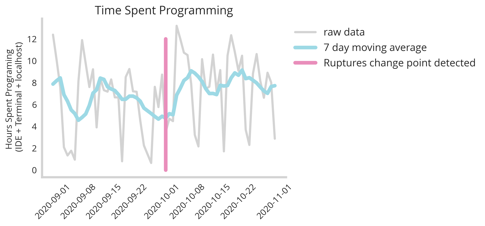
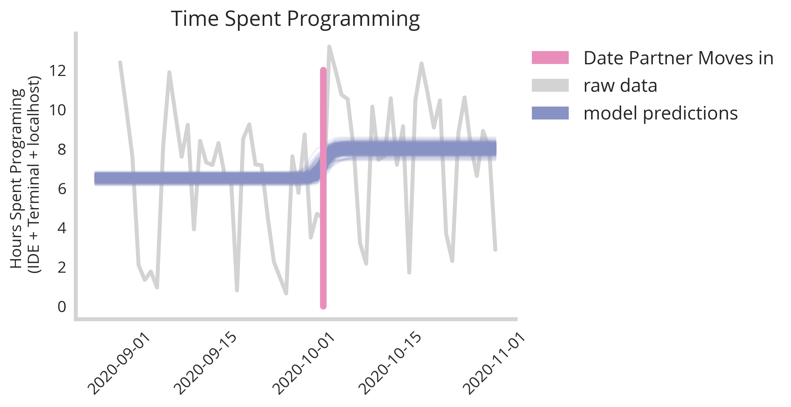
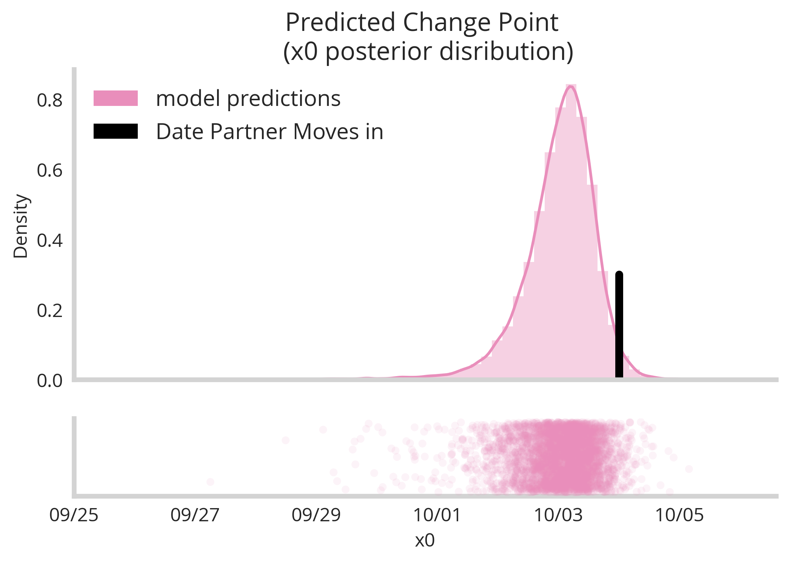
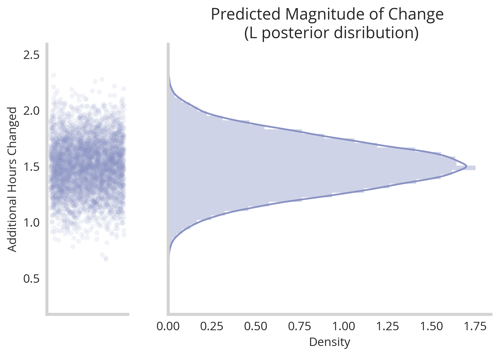
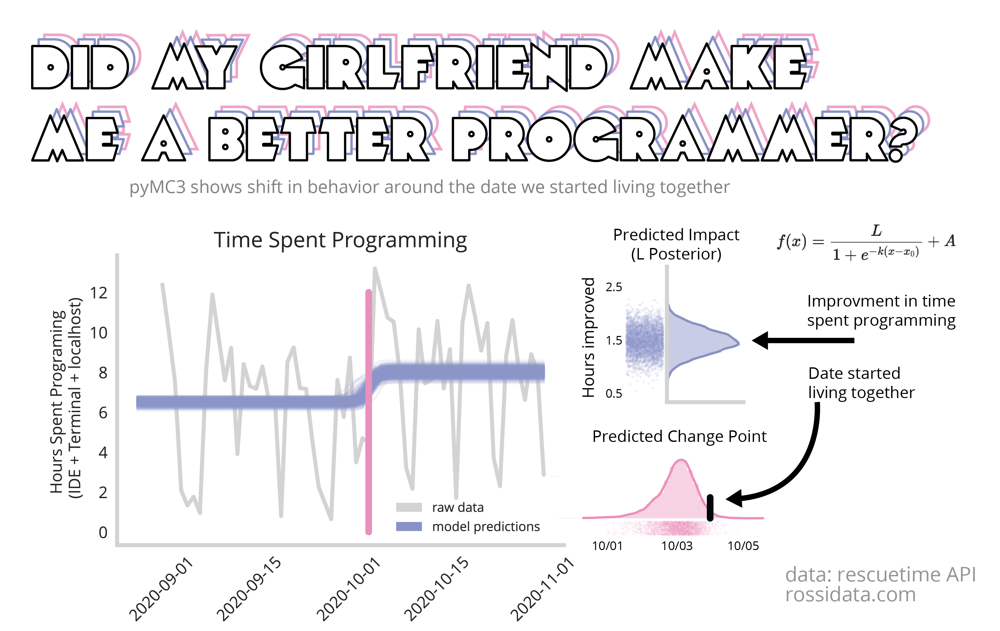

<html>
<link rel="stylesheet" href="/res/blog_15/manni.css">
<style>
@font-face {
  font-family: 'futura';
  src: url('/res/blog_10/futura.ttf') format('truetype');
  font-weight: normal;
  font-style: normal;
}
  h1,h2,h3,head,title {
    font-family: 'futura',serif;
    color: Black;
    background-color: lightgrey;
  }
</style>
</html>
<script type="text/javascript" async
  src="https://cdn.mathjax.org/mathjax/latest/MathJax.js?config=TeX-AMS_CHTML">
</script>


**TLDR;  Notebook necessary to explore this data process hands on and generate all the graphs** [here](https://github.com/NicholasARossi/UQ_methods/blob/master/notebooks/02_PyMC3_methods.ipynb) 

In this entry in our *quantifying uncertainty* series, we take our first look at time-series data. There are tons of really interesting questions that can be answered about time-series data with ML methods - from forecasting to causality inference -which all have room for uncertainty quantification.

In this post, I will take a look at one of the simplest methods to apply to a time-series trace : **change-point detection**. 


### Did my partner moving in make me a better programmer?


If you're given a time series trace like the price of a stock or traffic patterns over time, one of the simplest questions you can ask about it is : is there a moment in time where things changed, and by how  much did they change? 

Recently, I bought a house with my partner and we moved in together for the first time. Lots of things change about your behavior when you live with someone else vs alone, and in the age of covid and permanent WFH I wondered if having a high-powered finance person in the house would motivate me to look more busy.

To begin, I used the [rescue time API](https://www.rescuetime.com/apidoc) to pull the stats of how much time I spend programming every day. This doesn't count meetings and other work related stuff, just time spent in the terminal, IDE or a localhost. 

Before asking if living together changed my behavior, lets ask the generic question...

```buildoutcfg
"From September to November, were there any points where I started programming more or less? If so, by how much?"
```

Typically, there are some established packages in Python like [ruptures](https://github.com/deepcharles/ruptures) to infer if something changed during a time-series. In fact, if we use a package like this, it will detect a change in a type series as below:




```buildoutcfg
Rupture Change detected at : 2020-10-02 00:00:00
```

We see that packages like ruptures do detect changes. For instance here ruptures finds an event that happened on the second of October. However we have no idea how certain we are that that is the exact date, nor are we certain about what direction the *change* happened. To elucidate the answers to these questions, we need a more sophisticated model and one that carries with it a mechanism to quantify our uncertainty our our estimates.


### Baysian change point detection with uncertainty quantification

In order to compute a nuanced metric around **what** happened and **when** it did, we turn now to [PyMC3](https://docs.pymc.io/), a bayesian framework for probabilistic model fitting. This ecosystem will enable us to quantify our uncertainty around which date the change in my programming behavior happened, and by how much it changed. This type of probabilistic ecosystem is structured around a model that it in turn infers the parameters of. For this we construct a modified logistic regression equation.

<center>
$$f(x)=\frac{L}{1+e^{-k(x-x_{0})}}+A$$
</center>

This is one of several equations you could use to map a change point detection algorithm, but I prefer this one because it represents the two values that are most interesting to me very plainly:
* **L** : is the value that represents the magnitude of the change; can be postive or negative
* **x0** : is the value that represents the change-point; in this case when we changed from programming at one rate to another.

Other values that we will represent in this model are:
* **k** : the steepness of the change from 
* **A** : the baseline level of programming before the change-point.
Thuis

### Python implementation
First I simply load in my data from the rescuetime API (preprocessed)
```python
rescue_time_data=pd.read_csv('../data/rescuetime_data.csv')
rescue_time_data['Date']=pd.to_datetime(rescue_time_data['Date'])
rescue_time_data=rescue_time_data.set_index('Date')
rescue_time_data['order_val']=np.arange(len(rescue_time_data))
```

Next we build out our model within the pyMC3 ecosystem
```python
import pymc3 as pm

def log_function(x,x0,k,A,L):
    return (L)/(1+np.exp(-k*(x-x0)))+A


mod = pm.Model()
with mod as logistic_model:
    # Priors for unknown model parameters
    x0 = pm.Uniform('x0', min(rescue_time_data['order_val']), max(rescue_time_data['order_val']))    
    k = pm.Normal('k', mu=0,sd=1)
    L = pm.Normal('L',mu=2,sd=1)
    A = pm.Normal('A',mu=6,sd=1)
    
    # Expected value of outcome
    x=rescue_time_data['order_val'].values
    mu=log_function(x,x0,k,A,L)

    # Likelihood (sampling distribution) of observations
    y_obs = pm.Normal('y_obs', mu=mu, observed = rescue_time_data['Hours'].values)

    map_estimate = pm.find_MAP()
    sampler=pm.Metropolis()

```

Each of our parameters requires us to define our priors. Here I've set the change point to a uniform distribution between the beginning and end of the data-set, and the rest to simply be normal distributions.

Next we evolve our posterior distributions - that is to say our inferred model parameters that fit the data.

```python
with mod:
    # draw 10000 posterior samples
    trace = pm.sample(10000,tune=5000)
```

I sorta went overkill with the sample size but there is no real harm except for computation time.

If we plot a sampling of our fitted models over our data we get something like this:



We see clearly there is convergence to a general specific time point with some variance in both exact moment and magnitude of the change. Extracting our posterior parameter x0 (the change-point) and plotting the distribution we get the following graph.



Here we see our model is relatively certain that a change-point occurred sometime between the 1st and the 5th of October. This confirm our suspicious that it's possible moving in with my partner on the 4th changed my programming behavior (no other life changes occurred during this time). 
Next, we ask the question by **how much** did my programming time increase. This was represented in our model by the **L** parameter, which we can observe the distribution of below.



According to this model fit, we can see clearly that there was a jump in productivity following the change point of around an hour and half per day. Of course there is some uncertainty around this estimate, represented elegantly by the width of the distribution. However, taken together we see our estimates for *x0* and *L* infer that moving in with my partner **did** have a positve impact on my programming habits. 

### Causality is very complicated, but uncertainty quantification can ground our conclusions

While it is very difficult to definitively say that moving in with my partner was the only reason for the increase my programming volume, our naive models about change point detection observed that there was a change-point that fell near the move in date, and my programming did experience a jump in volume. In essence, we're able to disprove the hypothesis that other changes happened at other points in time.

By looking at the distributions we see significant uncertainty around the exact jump (between 1 and 2 hours of programming productivity gained). This is a valuable number to consider and speaks to the power of these nuanced models that paint a better picture of the limitations of their inferences.

Thanks very much for reading, and see the links below to continue play further with this dataset and these methods.


### Notes
* Notebook necessary to generate all the graphs and more [here](https://github.com/NicholasARossi/UQ_methods/blob/master/notebooks/02_PyMC3_methods.ipynb)
* The rest of the model and helper scripts [here](https://github.com/NicholasARossi/UQ_methods)


