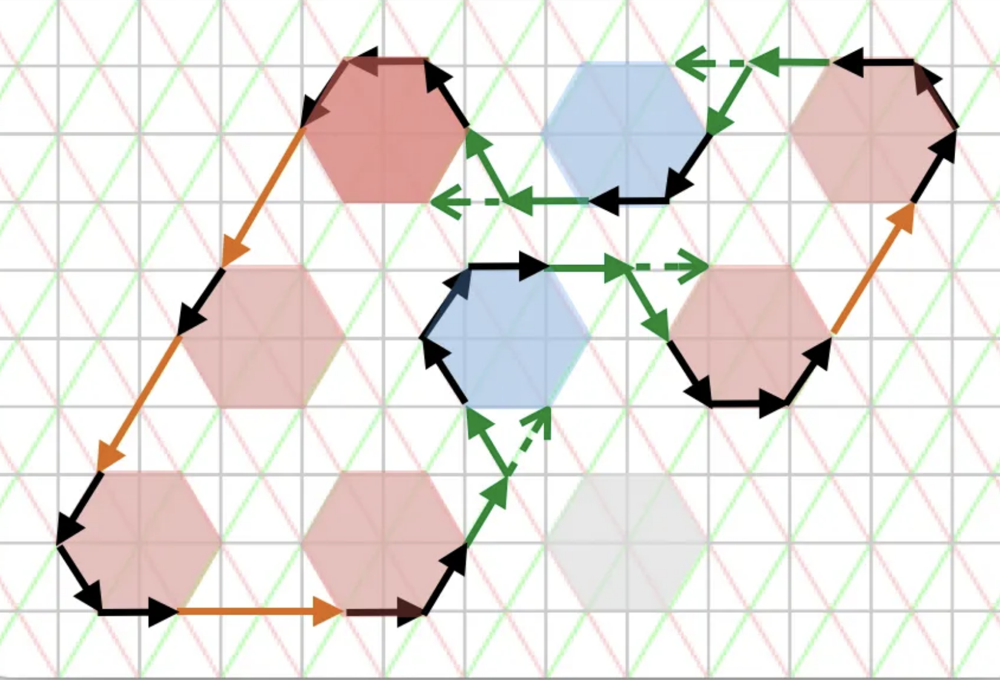
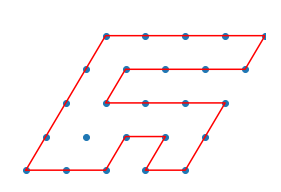
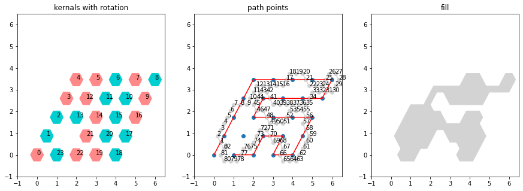
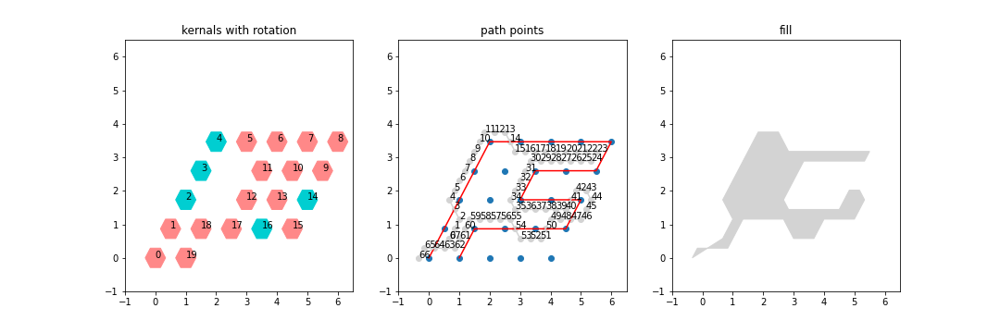
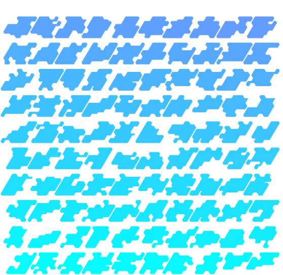
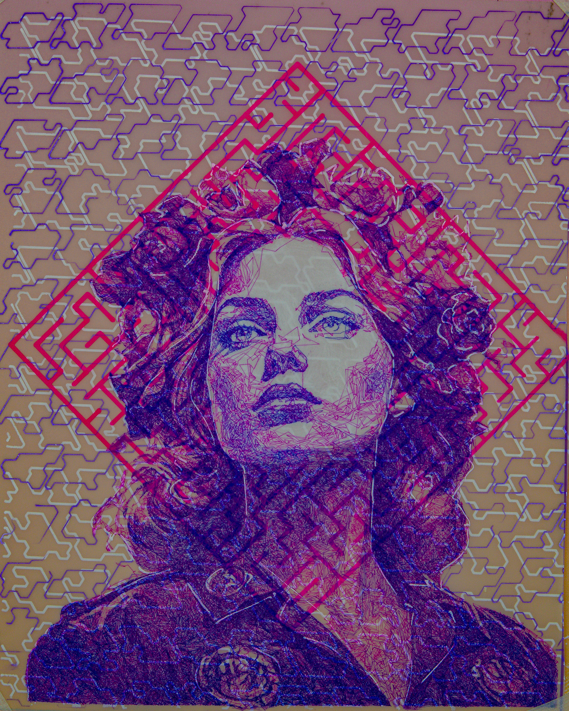
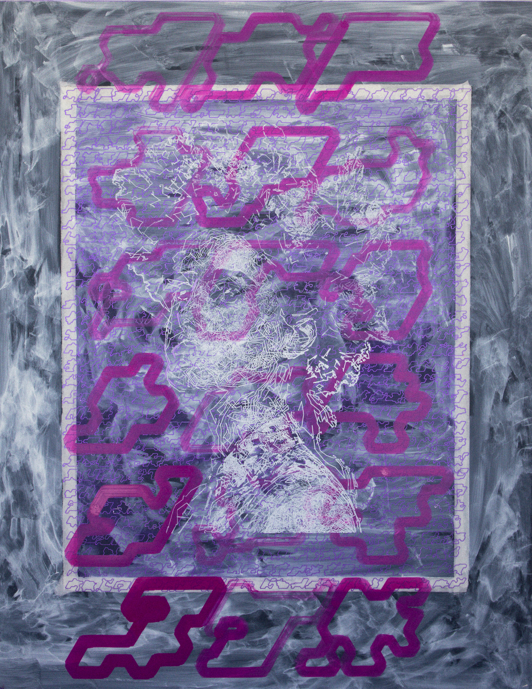
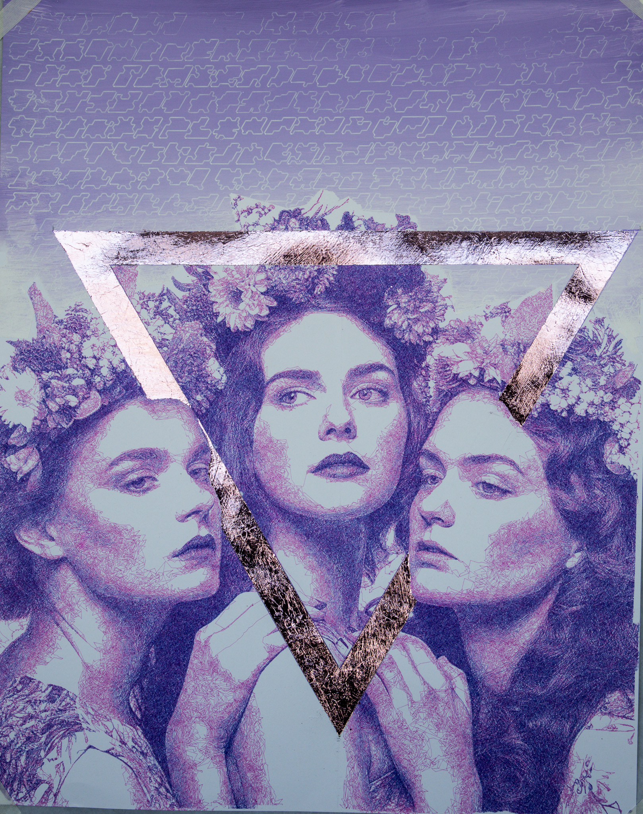

<html>
<link rel="stylesheet" href="/res/blog_21/new_style.css">
<style>
@font-face {
  font-family: 'Mister Pixel';
  src: url('/res/blog_21/Mister.otf') format('opentype');
  font-weight: normal;
  font-style: normal;
}
  h1,h2,h3,head,title,.page-heading h1 {
    font-family: 'Mister Pixel',serif;
    color: Black;
    background-color: #fff;
  }
</style>
</html>


"""

# Inspiration to implementation
I recently came across a fascinating blog post titled ["The Abundance Problem of Generative Art"]((https://medium.com/tangibit-studios/the-abundance-problem-of-generative-art-78398568b5d8)) that inspired me to explore the creation of a pure Python implementation of the concepts discussed. If you're interested in the aesthetic beauty of generative art and the thought process behind it, I highly recommend reading the blog post.

The blog post features a visually appealing figure that illustrates the path traversal, showcasing both the overall arc and the hexagonal embellishments. Take a look at the image below:





To build this generative art, I envisioned a two-step process:
(**TLDR** [demo notebook](https://github.com/NicholasARossi/generative_artforms/blob/main/notebooks/glyph_notebooks/glyph_demo.ipynb) [Full repository](https://github.com/NicholasARossi/generative_artforms/tree/main/glyphs))


# Step 1: Creating the Backbone
The first step involves creating a backbone, which is a closed cycle that traverses an NxN matrix. To achieve this, I developed a recursive function that satisfies the following constraints:

Start at position x, explore all adjacent locations, and repeat for x+1.
Exit the recursion if we return to x0 or if we cross our own trail (or paint ourselves into a corner).
Here's the Python code that implements this logic:

```python
size = 5
explorer = GridExplorer(size)
explorer.explore_closed_cylces()
path_idx = 5
fig = render_skeleton(explorer.all_paths[path_idx])
```
The resulting image represents the backbone of the generative art:




### Step 2: Filling in the Flourishes

In addition to the closed-form cycle, the generative art includes hexagonal "kernels" that rotate around the backbone, adding embellishments. 

To incorporate these flourishes, we instantiate rotations using a random selection process. Each position in the NxN matrix is assigned a value of 0 or 1, indicating whether or not a rotation will occur at that position. Here's an example of generating the rotations:
```python
rotations = np.random.choice(2, size ** 2).reshape((size, size))
array([[0, 1, 1, 0, 0],
       [1, 0, 1, 0, 0],
       [0, 0, 0, 1, 1],
       [0, 1, 1, 1, 0],
       [1, 1, 0, 0, 1]])

```
The glyph_path object represents the path traversing these rotations. We run the algorithm to generate the entire series of rotations and obtain the final result. Here's the code:

```python
glyph_path = GlyphPath(explorer.all_paths[path_idx], rotations)
glyph_path.run_all()
result_series = glyph_path.return_series()
result_series

```
Refer to the image below for a visualization:


### Generating Glyphs ad nausea
Now that we have the basics for generating one graph we can spin this up to n graphs, the code below generates the graphs with individual flourishes

```python
from tqdm import tqdm

successful_cylces = []
glyph_path_list = []

index = 0
target_value = 5000
with tqdm(total=target_value) as pbar:
    
    while len(successful_cylces) < target_value:
        index = (index + 1) % len(explorer.all_paths)

        rotations = np.random.choice(2, size ** 2).reshape((size, size))
        glyph_path = GlyphPath(explorer.all_paths[index], rotations)
        glyph_path.run_all()
        result_series = glyph_path.return_series()
        if not result_series['is_crossing']:
            successful_cylces.append(result_series)
            glyph_path_list.append(glyph_path)
            pbar.update(1)
result_df = pd.DataFrame(successful_cylces)
result_df['glyph_objects'] = glyph_path_list
```

here we see we're removing glyphys that are "crossing" those that create little nubbly bits, see below:


After we remove all these we can sort by a variety of metrics:
```python
sorted_df =result_df.sort_values(by='concavity')
glyphs = sorted_df.tail(100)['glyph_objects'].values.tolist()

fig= render_multipath_fill(glyphs,save_location ='color_sweep.png',color_profile='cool')
```




### Conclusion

This completes the implementation of the generative art based on the concepts discussed in the blog post.

Feel free to explore the code and adapt it to create your own unique generative art pieces. The possibilities are endless!


|------------------------------------------------|------------------------------------------------|------------------------------------------------|
|  |  |  |

For more images like these above follow my instagram at [@interlace_artforms](https://www.instagram.com/interlace_artforms/)


For the code:
* [demo notebook](https://github.com/NicholasARossi/generative_artforms/blob/main/notebooks/glyph_notebooks/glyph_demo.ipynb)
* [Full repository](https://github.com/NicholasARossi/generative_artforms/tree/main/glyphs))


