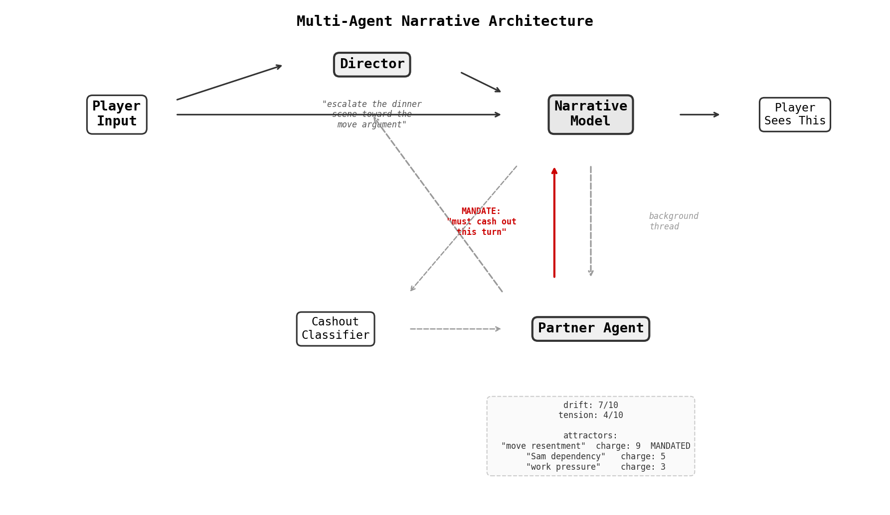
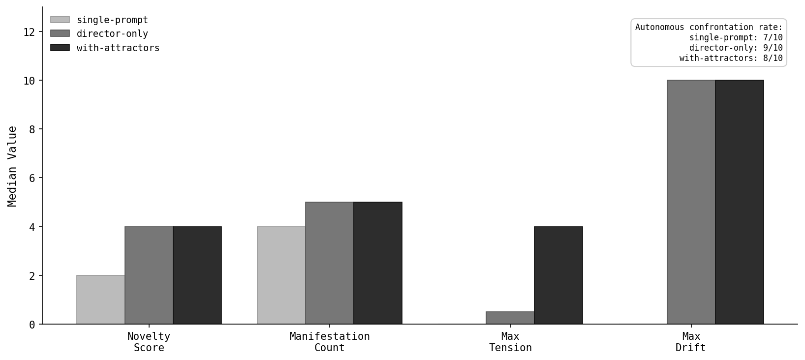
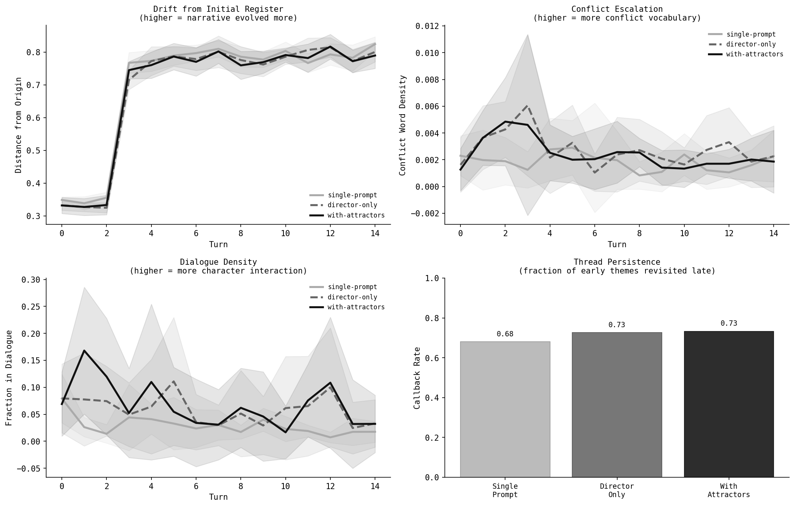
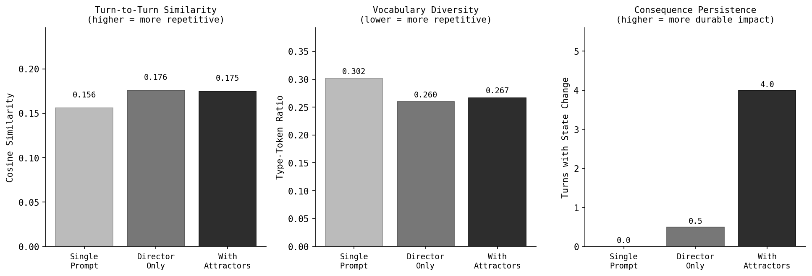

# The Problem: Dramatic Inertia

Interactive fiction built on a single LLM prompt has a structural problem. The model is autoregressive: each token is conditioned on every token already generated. In a multi-turn game, the model's own prior outputs become the dominant signal in the context window. Early outputs establish a tone, a register, a set of character dynamics — and then every subsequent output reinforces them.

I'm calling this **context poisoning**. The model settles into whatever mode it landed in during the first few turns. A passive player gets a pleasant, flat experience. An aggressive player gets escalation that never plateaus. The model doesn't converge on the same *words* — it converges on the same *dramatic register*. Each turn is superficially different but emotionally identical. Nothing genuinely escalates, because escalation requires pressure from outside the model's own feedback loop.

The fix is architectural, not prompt-level. You can instruct the model to "introduce surprising twists" — but its idea of a twist is conditioned on the same context that defines its current rut.

# The Architecture: Agents + Attractors

The solution is to decompose the single-prompt game into multiple agents with **different contexts and different objectives**:



**Three agents, three jobs:**

1. **Narrative Model** — writes the scene the player sees. Has the conversation history, a compressed summary, and two injected constraint blocks it must satisfy.

2. **Director** — a separate LLM call that reads the full game state and generates 3 pressure directions for the narrative model. The Director's goal is to *escalate*. It doesn't write prose — it writes directives.

3. **Partner Agent** — a background scorer that tracks **drift** (emotional distance) and **tension** (unresolved conflict). It also maintains a list of **attractors**.

## What Are Attractors?

Each attractor is a free-text label describing an unresolved relationship pattern — "resentment about the career sacrifice," "jealousy about the new friend," "the fight they keep almost having about money." The Partner Agent generates these organically based on what's happening in the narrative.

Each attractor has a **charge** (1-10). The charge dynamics create a pressure loop:

1. **Accumulation**: When the narrative ignores an attractor, the engine restores it with charge +1. Unresolved issues fester.

2. **Mandate**: At charge 8, the attractor enters **mandate**. A constraint block is injected: *"This pattern MUST manifest as a concrete in-scene event this turn."*

3. **Cashout**: A classifier determines whether the mandated attractor manifested. If it did, charge resets to 3 (spent but not dead). If the partner initiated a confrontation autonomously, tension goes up — bypassing the engagement-depth gate.

4. **Mutation**: If a mandated attractor goes 2+ turns without cashing out, it **mutates** — the engine replaces the label with something more urgent, more public, more consequential.

A passive player who never engages with relationship tensions will see those tensions accumulate charge, reach mandate, and force themselves into the narrative.

# The Experiment

To test this, I built [First Year](https://github.com/NicholasARossi/first-year) — a marriage simulator where the player manages a relationship with their spouse Alex during their first year of marriage in a new city.

The experiment compares **three conditions**:

- **Single-Prompt**: No Director, no Partner Agent. The raw narrative model with conversation history only. This is the "paste a scenario into Claude" experience.
- **Director-Only**: Director and Partner Agent are active, but attractor charge dynamics are disabled. Attractors exist in state but don't accumulate, mandate, or cash out.
- **With Attractors**: Full charge dynamics enabled.

**Protocol**: 10 rollouts per condition, 15 turns each, with deliberately passive player inputs ("I work from home today," "I scroll my phone on the couch," "I go grocery shopping alone"). The single-prompt condition gets no compression — its context fills with its own prior outputs, which is the point. The agentic conditions compress history periodically to stay within context limits.

Each rollout is independently judged by a separate Opus call that scores novelty (1-5), manifestation count, and whether the partner initiated confrontation autonomously.

# Results

## The judge metrics



| Metric | Single-Prompt | Director-Only | With Attractors |
|--------|--------------|---------------|-----------------|
| Novelty score | **2** | 4 | 4 |
| Manifestation count | **4** | 5 | 5 |
| Confrontation rate | **7/10** | 9/10 | 8/10 |
| Max tension | 0 | 0.5 | **4.0** |

The single-prompt model is measurably worse on every metric. Novelty drops from 4 to 2 — on a 5-point scale, that's the difference between "genuinely surprising" and "mostly predictable." Manifestation count drops from 5 to 4. Confrontation rate drops from near-universal to 7/10.

The Director is doing the heavy lifting for the first jump. Going from no agents to Director + Partner is the big gap: novelty doubles, manifestations go to ceiling, confrontation becomes near-certain. Attractors then add consequence persistence on top — tension climbs to 4.0 where Director-only stays near zero.

## Where the narrative gets trapped

The judge metrics tell you *that* single-prompt is worse. The next figure tells you *why*.



**Drift from Initial Register** (top-left) is the key panel. It measures the cosine distance of each turn's text from the centroid of turns 1-3 — how far the narrative has traveled from where it started.

The single-prompt model (light gray) flatlines. Over 15 turns, it barely moves away from its initial register. The model isn't repeating the same words — its type-token ratio is actually *higher* than the agentic systems. But it's trapped in the same dramatic mode. Each turn is superficially different but emotionally identical. The context is poisoned: the model's own bland prior outputs dominate the window and anchor it to the tone it established early.

The agentic systems (dark lines) diverge steadily. By turn 10, they've moved significantly further from their origin. External pressure — Director injections, mandate constraints — keeps pushing the narrative into territory the model wouldn't reach on its own.

**Conflict Escalation** (top-right) shows the agentic systems sustaining higher conflict vocabulary density across the run. The single-prompt model produces some conflict language but can't sustain it.

**Dialogue Density** (bottom-left) is a proxy for dramatic commitment. Characters speaking to each other — in quoted dialogue — is committed action. The agentic systems maintain more dialogue throughout. The single-prompt model retreats into narration and description.

**Thread Persistence** (bottom-right) measures what fraction of distinctive early-turn themes reappear in late turns (10-15). The agentic systems score 0.73 — they revisit nearly three-quarters of the threads they established early. The single-prompt model scores 0.68. It drops threads because nothing forces them back.

## Consequence persistence



The third panel is the cleanest result. **Consequence persistence** — how many turns actually alter tracked state — goes 0 → 0.5 → 4.0 across the three conditions. The single-prompt model has no state to alter. The Director produces dramatic scenes, but without charge dynamics those scenes don't leave marks on future state. With attractors, events compound: each cashout moves the tension dial, which changes the Director's next assessment, which changes the next scene.

# What This Shows

The experiment isolates two distinct contributions:

**The Director breaks the model out of inertia.** It's responsible for the entire confrontation and manifestation gap between single-prompt and the agentic conditions. A separate agent with different objectives, reading the same context but deciding *what should happen next*, is sufficient to produce scenes the model would never generate on its own.

**Attractors create consequence persistence.** The Director can produce a dramatic confrontation at turn 5. Without attractors, that confrontation is cosmetic — the game's tracked state is unchanged by turn 6. With attractors, unresolved patterns accumulate charge, mandate themselves back into the narrative, and feed cashout results into future state. Events stick.

The pattern generalizes. Any multi-turn LLM system that needs to avoid register-lock — customer service bots, creative writing assistants, simulation environments — faces the same structural problem:

1. **Separate the pressure source from the response generator.** The thing that decides *what should happen* must have different objectives than the thing that decides *how to say it*.

2. **Accumulate state outside the conversation.** The conversation context is autoregressive poison. Tracked state — dials, charges, mandates — persists without being subject to the model's tendency to smooth and settle.

3. **Use mandate thresholds, not instructions.** "Be surprising" is a prompt instruction the model filters through its poisoned context. "This attractor has charge 9/10 and MUST cash out this turn" is a structural constraint it cannot ignore.

# Limitations

The LLM-as-judge methodology has an obvious tension with the thesis: if LLMs are unreliable self-evaluators trapped in autoregressive loops, using one as the novelty judge is circular. The drift-from-origin metric sidesteps this — it's a pure text measurement with no LLM judgment involved. But the novelty and manifestation scores should be taken as directional, not definitive. A blinded human evaluation would be stronger evidence.

The experiment also starts from a high-drama fixture (drift=9, one mandated attractor). A neutral-start experiment would better test whether attractors can break a narrative *out* of flatness rather than sustaining escalation from an already-charged state.

# Try It

The full implementation is at [github.com/NicholasARossi/first-year](https://github.com/NicholasARossi/first-year).

```bash
git clone https://github.com/NicholasARossi/first-year.git
cd first-year
python play.py
```

Run `python play.py --no-attractors` for Director-only, or `python play.py --no-director --no-partner` for the single-prompt experience. The difference is visceral at 10+ turns.
