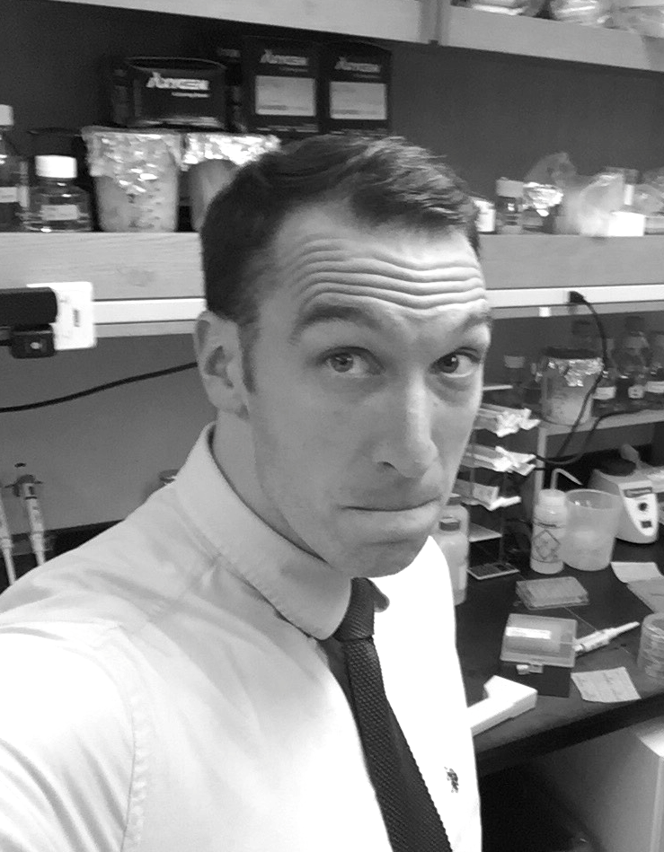

Hello. My name is Nicholas Rossi. I'm a PhD candidate at Boston University studying in the <a href="http://www.dunloplab.com/">Dunlop Lab</a>. Previously, I worked in the department of theoretical physics at École Normale Supérieure in Paris working with [Aleksandra Walczak](http://www.phys.ens.fr/~awalczak/). I try to achieve end to end control in science by running experiments, building models and analyzing statistical phenomena.

You can find me at the following locations:
- [Twitter](https://twitter.com/DivergentData)
- [GitHub](https://github.com/nicholasarossi)

Email : nrossi (at) bu.edu

[resume](resume.pdf)
