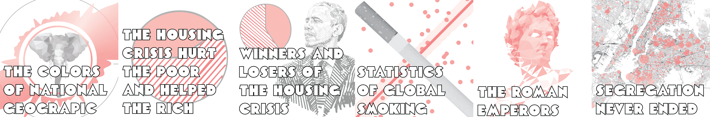

  <link href='https://fonts.googleapis.com/css?family=Permanent+Marker' rel='stylesheet' type='text/css'>

<iframe src="brand-logo/index.html" width="100%"  height="300px" frameBorder="0"></iframe>

### Hi there 👋

I am a PhD full-stack engineer using machine-learning to tackle projects in Genetics, Language, Animation and whatever's next

### Machine Learning Apps

- **[听好了 : a deep learning platform for mandarin tone practice](https://www.tinghaole.com/)**

### Machine Learning Competitions 

- **[Cochlear Implant Hackathon (February, 2021)](https://github.com/NicholasARossi/Cochlear_Implant_Hackathon)**
- **[Genetic Attribution Challenge (October, 2020)](https://github.com/NicholasARossi/genetic_attribution_challenge)**

### Data Science Stories

### Science
-  **CRISPRoff enables spatio-temporal control of CRISPR editing (2020)**

-  **[Forecasting cell fate during antibiotic exposure using stochastic gene expression (2019)](https://gitlab.com/dunloplab/forecasting-cell-fate)**

-  **Making Waves with Synthetic Oscillators (2018)**

-  **[Active degradation of MarA controls coordination of its downstream targets (2018)](https://github.com/NicholasARossi/MarA-Halflife-2018)**

-  **[Customized Regulation of Diverse Stress Response Genes by the Multiple Antibiotic Resistance Activator MarA (2017)](https://github.com/NicholasARossi/MarA-Multigene-Regulation)**

# Contact

<iframe src="brand-logo/buttons.html" width="100%"  height="85px" frameBorder="0" ></iframe>

Email : nicholas.rossi2 (at) gmail.com

[resume](Nicholas_Rossi_07252021.pdf)