# My work with Spotify

I've been part of [Spotify](https://www.spotify.com/) since day one (up until september 2010 when I joined [Facebook](https://www.facebook.com/)). The lush green, the dull grey, the innovative user interface — that's me.

I was the head of everything-design — creative & art director, interaction designer and graphic designer as well as shooting both still and moving pictures. The brand identity (logotype, business cards, style guides, office architecture, etc) is my work as well as the different end user client applications (interaction design).

## The Spotify brand

Spotify is green. We're talking Pantone 376 green.

My busy desk in our first office at Riddargatan 20 in Stockholm:

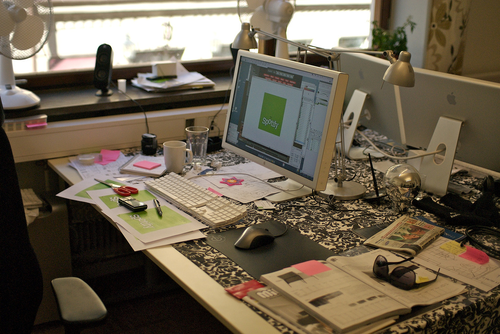

## Desktop application

The Spotify desktop application come in a dark grey fashion and is used by millions of people every day, on Mac OS, Windows and Linux. Standard user interface treats like window controls and scrollbars obey the host system while we have taken some semi-conservative-but-still-daring steps for other elements.

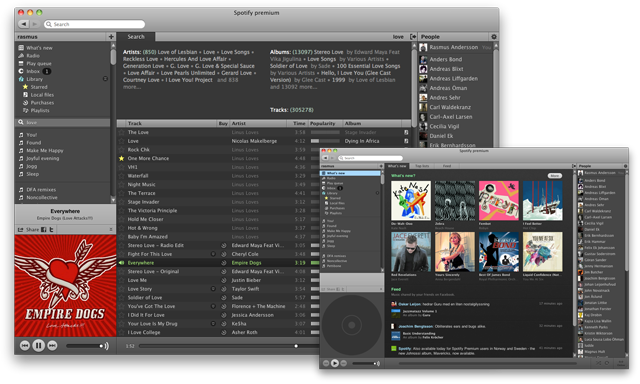

Hand crafted pixels

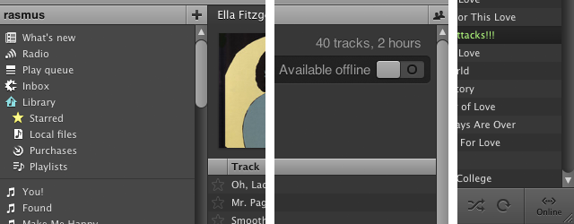

A dynamic user interface which offers a limited set including the most important features through clearly visible controls (like play, skip track, search, sharing, etc), while providing more advanced users with slightly less common functionality — e.g. resizing views, jumping to playing context, queueing tracks, and so on.

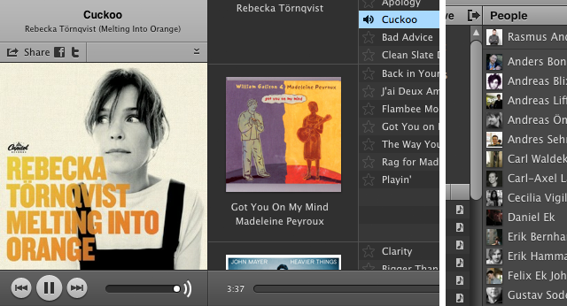

We also tried to keep settings to a minimum with thought-through & sensible defaults.

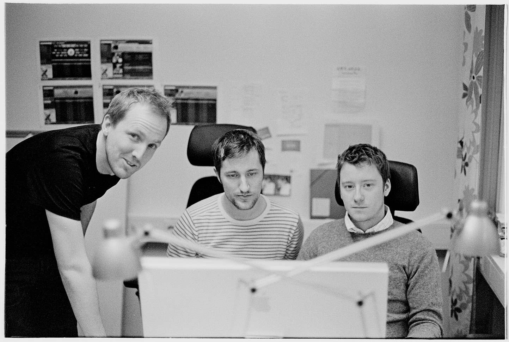

Pictured above: Per, Mattias & Me stretching out some Mac OS interface issues.

## Mobile applications

Since Spotify is a service "in the cloud" and it's all about music, people need to access Spotify wherever they are — on a bike, traveling abroad or just walking around in the city. We created Spotify client applications for a number of different devices and platforms including Apple iOS (i.e. iPhone), Android and Nokia S60.

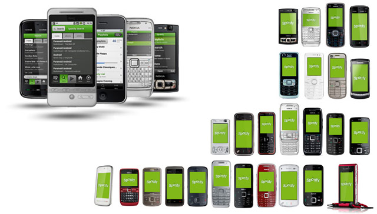

## Design process

I'm the kind of designer who place myself closer to "architect" than "artist" in the spectrum of art–science ratio. Sketching on good old paper with a graphite pencil beats all (early-stages) prototyping software I've tried. It's easy to interact with and everyone can join in.

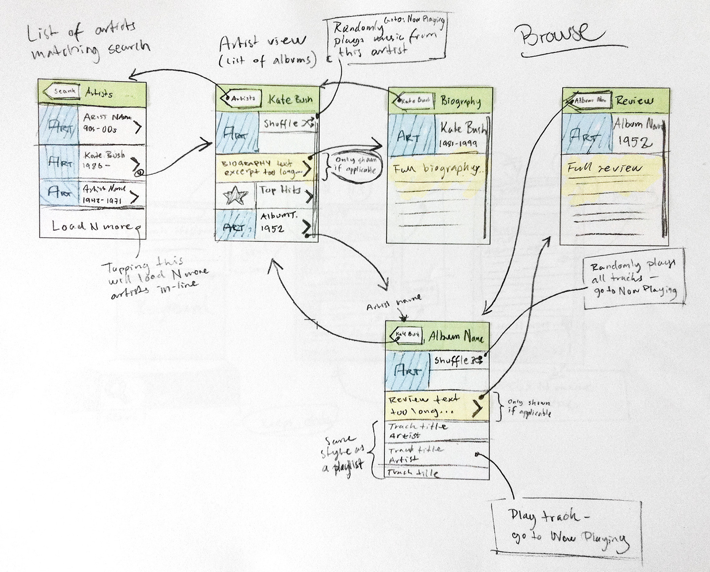

Marrying function with form is a natural part of human–machine interfaces, thus embedding notes on functionality and form when sketching out the rough flow comes natural and saves on bureaucracy.

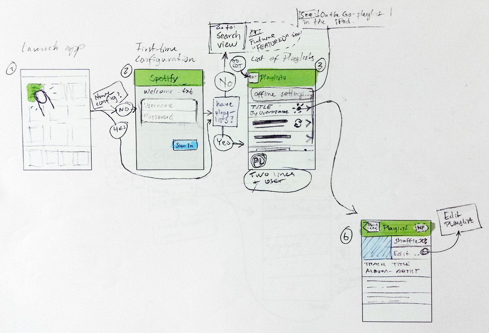

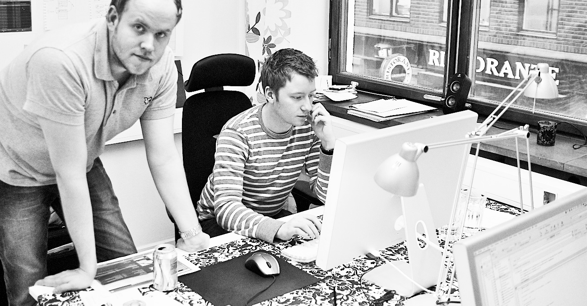

Keeping all stakeholders in the loop during the early stages of the design process is crucial.

Later moving on with computer aided sketching and prototyping.

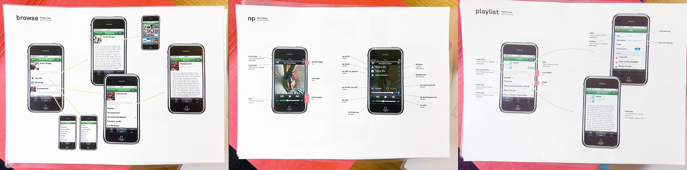

Communicating component dimensions, colors, fonts, etc to the engineers was often done through simple print-outs.

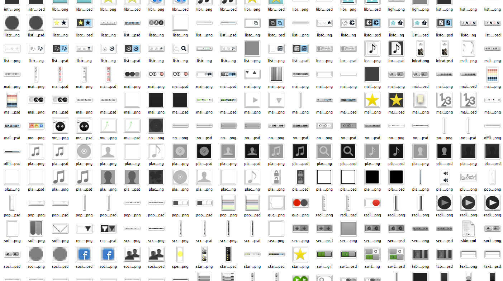

Most graphic resources like icons and controls where first sketched on paper, then drawn as vector-based computer images and finally visualized by means of hand-crafted pixels, ending up as PNG image data.

## Culture

The Spotify culture has always played an important role in the (internal) success of Spotify. Ever since day one there have been that "happy start-up" feeling where mottos like "if we have fun we will produce good stuff" fit in.

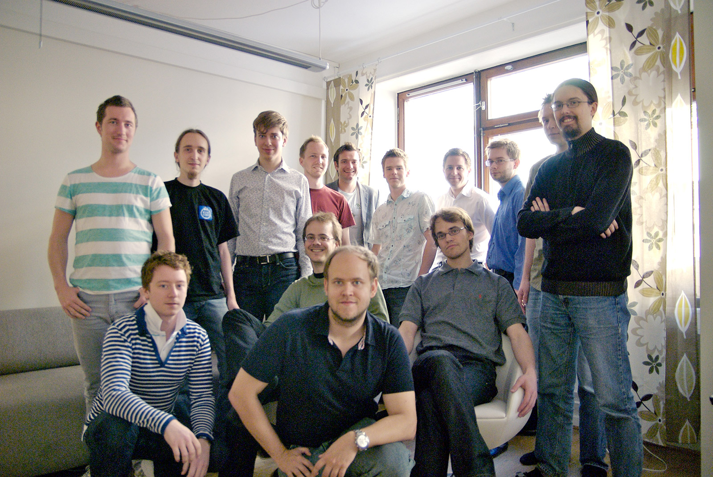

*Above* Here we are in 2007. We had just finished the very first release of Spotify to which friends and family where given access. In contrast; three years later there are more than 200 people employed by Spotify in seven different countries.

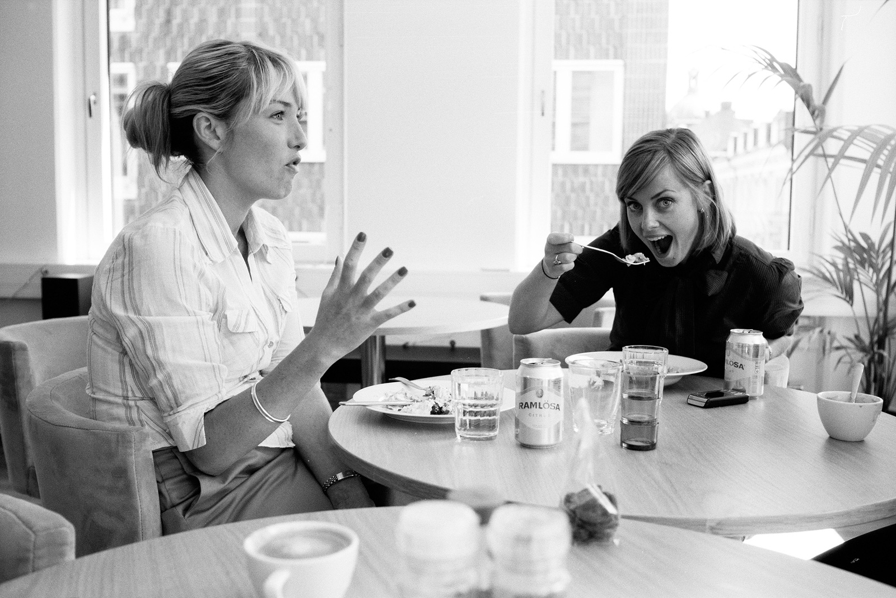

Roberta and Sophia, probably plotting ["Roberta from Spotify"](http://www.independent.co.uk/life-style/gadgets-and-tech/features/tim-walker-like-a-charity-mugger-roberta-from-spotify-is-secretly-after-my-money-1667721.html).

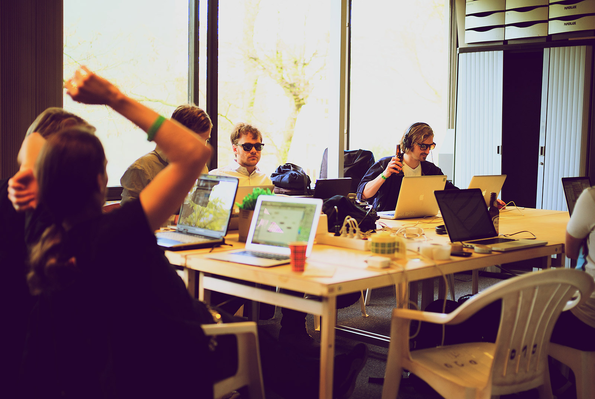

Code, code, code and dance music.

[More photos from the early and late life of Spotify &rarr;](https://www.flickr.com/photos/rsms/tags/spotify/)
